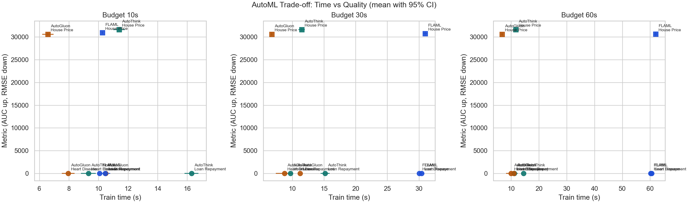

<p align="center">
  <h1 align="center">AutoThink</h1>
  <p align="center"><strong>Throw any data, get a working model.</strong></p>
</p>

<p align="center">
  <a href="https://pypi.org/project/autothink/"></a>
  <a href="https://pypi.org/project/autothink/"></a>
  <a href="https://github.com/ranausmanai/autothink/blob/main/LICENSE"></a>
  <a href="https://github.com/ranausmanai/autothink/actions"></a>
  <a href="https://github.com/ranausmanai/autothink/stargazers"></a>
</p>

<p align="center">
  One-click AutoML for tabular data.<br>
  Auto-detects task type &bull; Engineers features &bull; Trains LightGBM + XGBoost + CatBoost &bull; Optimizes blend weights<br>
  <strong>All in a single function call.</strong>
</p>

---

## Quickstart

```bash
pip install autothink
```

```python
import pandas as pd
from autothink import fit

df = pd.read_csv("train.csv")
model = fit(df, target="price")
predictions = model.predict(pd.read_csv("test.csv"))
```

**That's it. Three lines.**

---

## How It Works

<p align="center">
  
</p>

| Step | What happens |
|------|-------------|
| **Task detection** | Determines binary, multiclass, or regression from the target column |
| **Data validation** | Checks for leakage, class imbalance, and quality issues |
| **Preprocessing** | Handles missing values, one-hot / target-encodes categoricals, scales numerics |
| **Feature engineering** | Learns optimal split thresholds and feature interactions from data |
| **Ensemble training** | Trains LightGBM, XGBoost, and CatBoost with adaptive hyperparameters |
| **Blend optimization** | Finds optimal ensemble weights via scipy on out-of-fold predictions |
| **Calibration** | Platt scaling for well-calibrated probabilities |
| **Verification** | Post-training diagnostics: fold variance, leakage, feature importance |

---

## Installation

**From PyPI:**
```bash
pip install autothink
```

**From source:**
```bash
git clone https://github.com/ranausmanai/autothink.git
cd autothink
pip install -e .
```

**With optional extras:**
```bash
pip install autothink[dev]   # pytest
pip install autothink[api]   # FastAPI serving
pip install autothink[onnx]  # ONNX export
```

---

## API Reference

### `fit(df, target, **kwargs)`

One-line AutoML. Returns a fitted `AutoThinkV4` instance.

| Parameter | Type | Default | Description |
|-----------|------|---------|-------------|
| `df` | `DataFrame` | *required* | Training data (features + target) |
| `target` | `str` | *required* | Name of the target column |
| `time_budget` | `int` | `600` | Maximum training time in seconds |
| `verbose` | `bool` | `True` | Log progress to console |

### `AutoThinkV4`

```python
from autothink import AutoThinkV4

model = AutoThinkV4(time_budget=300, verbose=True)
model.fit(df, target_col="price")
preds = model.predict(test_df)
```

**Attributes after fitting:**

| Attribute | Description |
|-----------|-------------|
| `model.cv_score` | Mean cross-validation score |
| `model.cv_std` | CV score standard deviation |
| `model.task_info` | Detected task type, metric, class info |
| `model.verification_report` | Post-training diagnostics |

### Logging

AutoThink uses Python's `logging` module. The library is **silent by default**.

```python
import autothink
autothink.setup_logging()  # Enable INFO-level output to stderr
```

Or just use `verbose=True` (the default) which auto-configures a console handler.

---

## Benchmarks

Benchmark run date: **February 16, 2026**.

### Credible Matrix (3 seeds x 3 budgets)

- Seeds: `42, 1337, 2025`
- Budgets: `10s, 30s, 60s`
- Total fits: `81` (`3 datasets x 3 budgets x 3 seeds x 3 tools`)
- All runs completed: `81/81`

Artifacts:
- Raw runs: [`benchmarks/credible/benchmark_raw.csv`](benchmarks/credible/benchmark_raw.csv)
- Aggregated summary: [`benchmarks/credible/benchmark_summary.csv`](benchmarks/credible/benchmark_summary.csv)
- Full markdown report: [`benchmarks/credible/benchmark_report.md`](benchmarks/credible/benchmark_report.md)
- Pareto chart (time vs quality): [`benchmarks/credible/pareto_by_budget.png`](benchmarks/credible/pareto_by_budget.png)

<p align="center">
  
</p>

### Winner Counts (by dataset-budget cell)

| Tool | Wins (out of 9) |
|------|----------------:|
| AutoThink V4 | **4** |
| AutoGluon | 3 |
| FLAML | 2 |

### Detailed Means (+/-95% CI)

| Budget | Dataset | AutoThink V4 | FLAML | AutoGluon |
|--------|---------|--------------|-------|-----------|
| 10s | Heart (AUC ↑) | **0.95299 +/- 0.00445** (9.32s) | 0.95245 +/- 0.00596 (10.07s) | 0.95245 +/- 0.00524 (7.95s) |
| 10s | Loan (AUC ↑) | **0.91236 +/- 0.01778** (16.30s) | 0.90902 +/- 0.02191 (10.46s) | 0.91165 +/- 0.01683 (10.49s) |
| 10s | House (RMSE ↓) | 31627.97 +/- 321.55 (11.39s) | 30917.18 +/- 260.50 (10.26s) | **30589.44 +/- 381.04** (6.57s) |
| 30s | Heart (AUC ↑) | **0.95299 +/- 0.00445** (9.71s) | 0.95254 +/- 0.00518 (30.06s) | 0.95245 +/- 0.00524 (8.78s) |
| 30s | Loan (AUC ↑) | **0.91236 +/- 0.01778** (15.18s) | 0.91191 +/- 0.01884 (30.42s) | 0.91165 +/- 0.01683 (11.23s) |
| 30s | House (RMSE ↓) | 31627.97 +/- 321.55 (11.49s) | 30743.65 +/- 474.66 (30.99s) | **30589.44 +/- 381.04** (6.76s) |
| 60s | Heart (AUC ↑) | 0.95299 +/- 0.00445 (11.20s) | **0.95335 +/- 0.00478** (60.24s) | 0.95245 +/- 0.00524 (10.02s) |
| 60s | Loan (AUC ↑) | 0.91236 +/- 0.01778 (14.46s) | **0.91387 +/- 0.01779** (60.58s) | 0.91165 +/- 0.01683 (10.97s) |
| 60s | House (RMSE ↓) | 31627.97 +/- 321.55 (11.64s) | 30623.40 +/- 476.28 (61.98s) | **30589.44 +/- 381.04** (6.76s) |

<sub>Reproduce with: `python benchmark_matrix.py --budgets 10,30,60 --seeds 42,1337,2025 --outdir benchmarks/credible`</sub><br>
<sub>Note: AutoGluon ran without FastAI extras (`autogluon.tabular[fastai]`), so optional NN models were skipped.</sub><br>
<sub>Note: Some tools may slightly exceed nominal budget due to setup/cleanup and internal training loops.</sub>

---

## Examples

See the [`examples/`](examples/) directory:

| Example | Description |
|---------|-------------|
| [`quickstart.py`](examples/quickstart.py) | Minimal 15-line fit/predict on sklearn data |
| [`kaggle_competition.py`](examples/kaggle_competition.py) | Full Kaggle pipeline with CLI and submission output |
| [`benchmark.py`](examples/benchmark.py) | Compare AutoThink against FLAML |

---

## Project Structure

```
autothink/
  __init__.py            # Public API: fit(), setup_logging()
  core/
    autothink_v4.py      # Main engine (TaskDetector, IntelligentEnsemble, AutoThinkV4)
    autothink_v3.py      # V3 engine (Kaggle-optimized)
    autothink_v2.py      # V2 engine (meta-learning)
    preprocessing.py     # IntelligentPreprocessor, FeatureEngineer
    feature_engineering_general.py  # Adaptive, data-driven feature engineering
    validation.py        # DataValidator, LeakageDetector
    meta_learning.py     # MetaLearningDB, dataset fingerprinting
    production.py        # ModelExporter, ModelCard, DriftDetector, APIGenerator
    advanced.py          # CausalAutoML, ExplanationEngine, SmartEnsemble
    kaggle_beast.py      # Competition-grade ensemble mode
    kaggle_fast.py       # Fast Kaggle mode
tests/                   # 25 tests (pytest)
examples/                # Quickstart, Kaggle, benchmark
```

---

## Contributing

Contributions are welcome! Please open an issue or submit a PR.

```bash
# Development setup
git clone https://github.com/ranausmanai/autothink.git
cd autothink
pip install -e ".[dev]"
pytest tests/
```

---

## License

Apache 2.0 — see [LICENSE](LICENSE).

---

<p align="center">
  <sub>Built with scikit-learn, LightGBM, XGBoost, and CatBoost.</sub>
</p>
